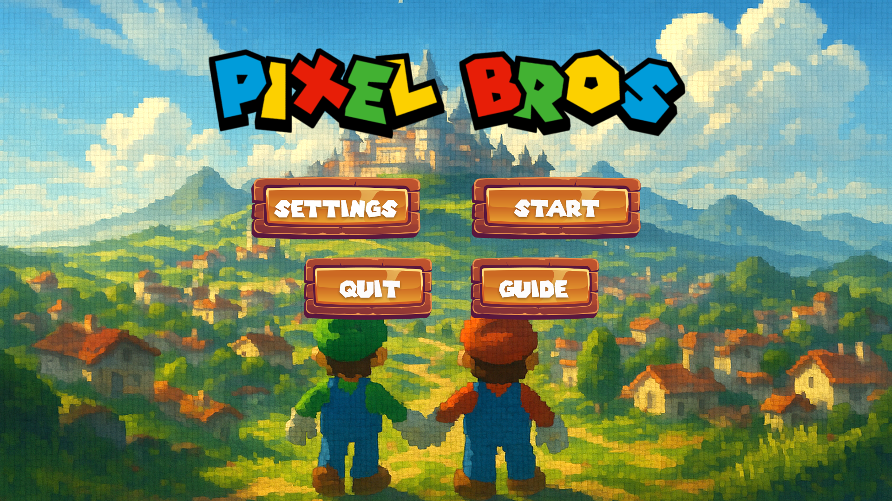

# 
 🎮  Pixel Bros (by Mario & Luigi Team) 

## 📖 Description  
This is a **2D Platformer Game** developed with **Unity**.  
The game is designed for **two players**, meaning it has **two characters** that can play together in **offline** or **online co-op** modes.  
Players must move through levels, avoid obstacles, and defeat enemies to reach the goal.  

## ✨ Features  
- Two-player gameplay (two characters)  
- Single-player and multiplayer support (offline & online co-op)  
- Lobby system with login/registration  
- Save & load system  
- Multiple levels with unique challenges  
- Background music and sound effects  
- Simple and user-friendly UI  

## 🛠️ Technologies Used  
- **Unity** (Game Engine)  
- **C#** (Scripting)  
- **Netcode for GameObjects** (Multiplayer networking)  
- **PlayFab** (Account system & backend)  
- **Git** (Version control)

## 🚀 Installation
👉 [Play the Game](https://username.github.io/repo-name/)

## 🎮 Controls
The control guide is available in the Main Menu of the game.

## 👥 Members
- **Farzaneh Fakhri**
- **Kimia Ghamarimanesh**

---

  

